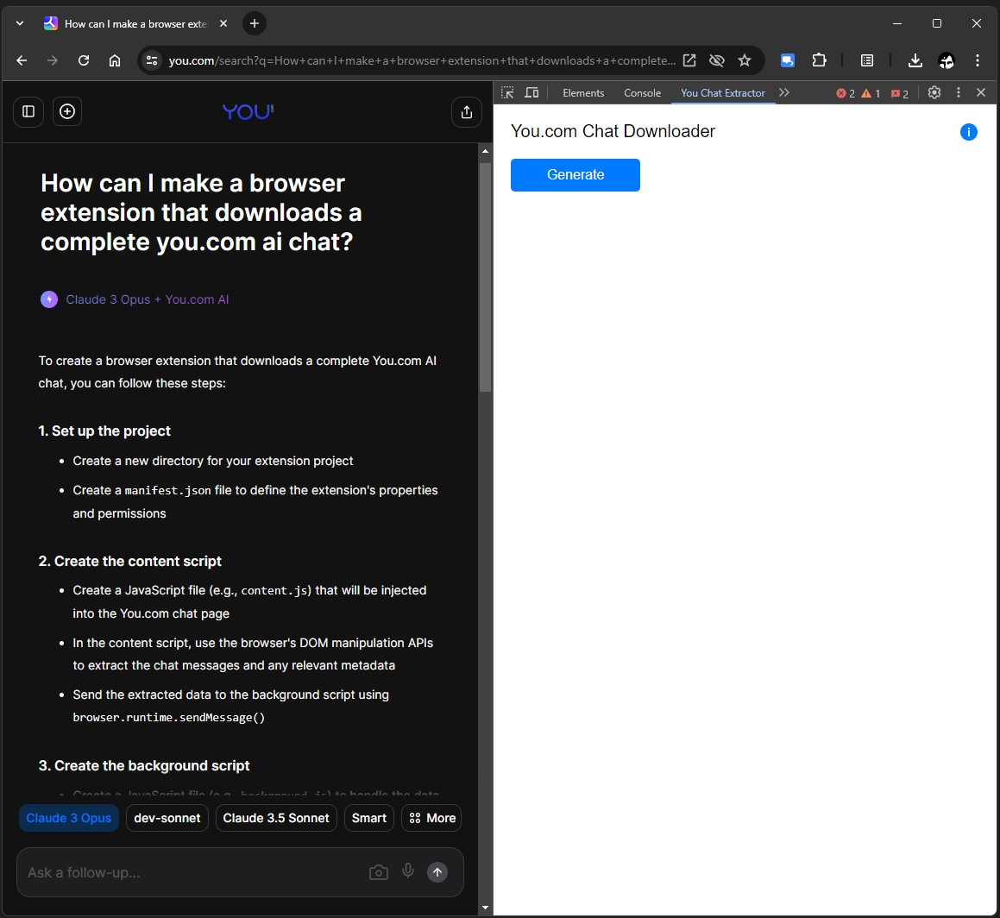
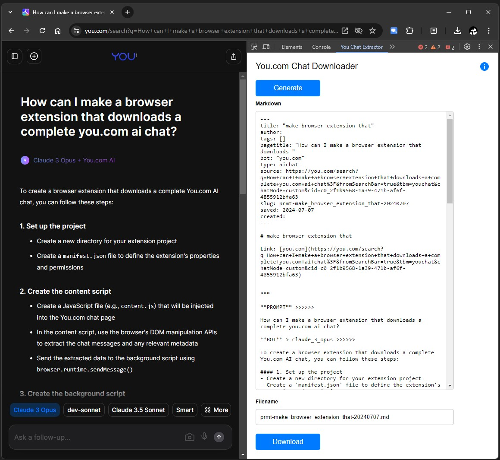
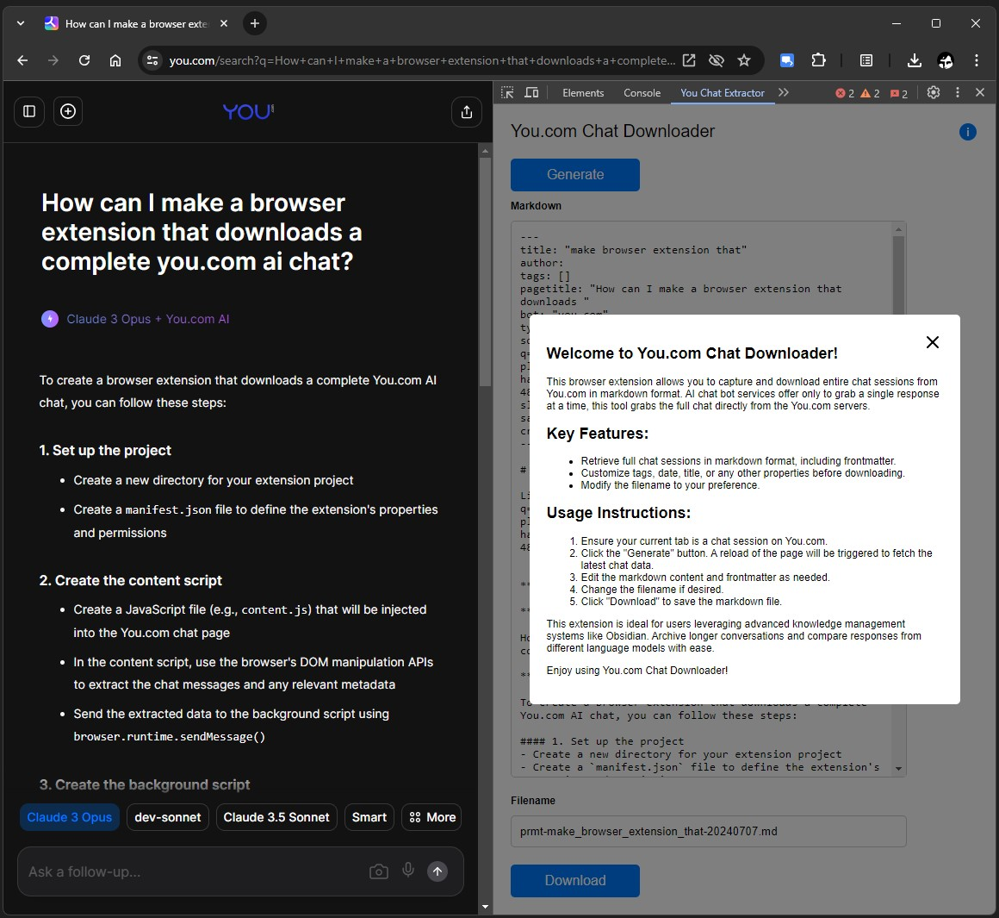

# You.com Chat Downloader

## Overview

You.com Chat Downloader is a powerful devtool browser extension designed to capture entire chat data from YouSearch servers and convert it into markdown format. This extension provides a convenient way to download full chat sessions, complete with editable frontmatter, directly from You.com.

## Features

- **Full Chat Capture**: Download the entire chat session in markdown format directly from the You.com server, bypassing the need to convert HTML to markdown.
- **Editable Frontmatter**: Automatically generated frontmatter includes tags, date, title, and other properties that can be edited before download.
- **Custom Filename**: The filename for the markdown file is displayed and can be modified before downloading.

## Benefits

This extension is particularly beneficial for users utilizing advanced knowledge management systems like Obsidian for note organization and retrieval. It enables archiving of longer conversations and comparison of responses from different large language models.

## Installation

1. Clone this repository to your local machine.
2. Press the "Extensions" icon in your browser.
3. Choose "Manage Extensions"
4. Make sure you have enabled developer mode.
5. Press "Load unpacked" and select the cloned repository on your local machine.
6. The extension "You.com Chat Downloader should now appear among other extensions and you can close the tab.

## Usage

Assuming you have a chat session open in the current tab in your browser:

1. Open DevTools, either by right-clicking and choosing `inspect` or pressing `F12`.
2. Activate the DevTools "You.com Chat Downloader" panel in the top row. It may be the last in item in the list of tabs starting with "Elements". 
3. Click the "Generate" button in the panel. This will trigger a reload of the page.
4. Review and edit the markdown content and frontmatter.
5. Modify the filename if desired.
6. Press the "Download" button to download the markdown file.

The main view:

Markdown ready to be edited and downloaded:

The information modal:

## Contributing

Contributions are welcome! Please submit a pull request or open an issue to suggest improvements or report bugs.

## License

This project is licensed under the MIT License.
