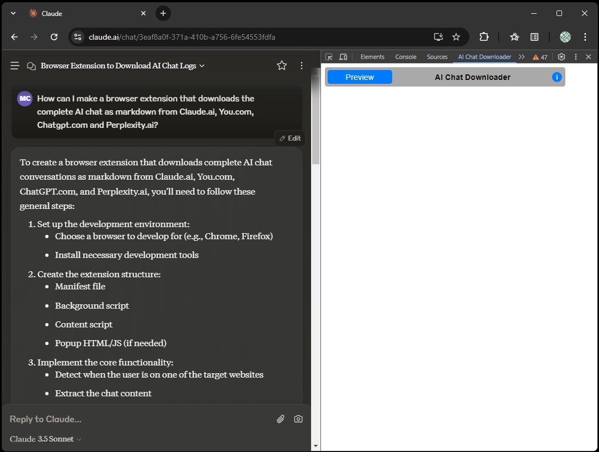
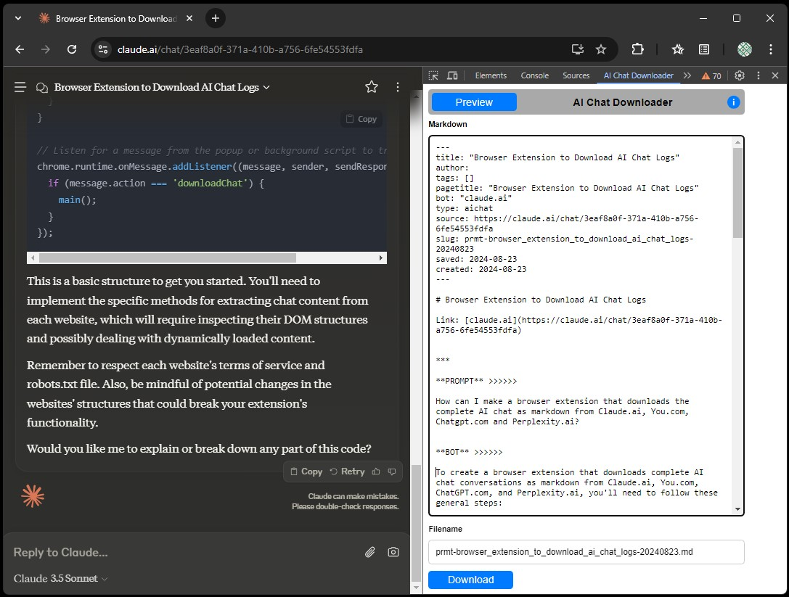

# AI Chat Downloader

A browser extension for downloading entire AI chat sessions in markdown format.

## Overview
AI Chat Downloader allows you to capture full conversations from:

Here are the items converted into markdown links:

- [**claude.ai**](https://claude.ai)
- [**perplexity.ai**](https://perplexity.ai)
- [**chatgpt.com**](https://chat.openai.com)
- [**you.com**](https://you.com)

The browser extension automatically generates a frontmatter, chat and filename, and includes links to sources when available. It will first display a preview of the AI chat in markdown format, so you can edit the frontmatter, chat or filename before downloading.

The problem is that current AI chatbot services offer only to copy a single response at a time, making it cumbersome to save and share full AI chats. This browser extension is also ideal for users who use knowledge management systems like Obesidian or Notion, or whoever want to share or compare AI chat responses. 

The markdown is taken directly from the AI Chats servers - without using any tools for webscraping or conversion - which assure the highest quality output possible. 

## Features

- **Full AI Chat Capture**: Download the entire chat session in markdown format, bypassing the need for scraping or converting HTML to markdown.
- **Editable Preview**: Automatically generated frontmatter includes title, date and chat which all can be edited before download.
- **Custom Filename**: The filename for the markdown file is displayed and can be modified before downloading.

## Installation

1. Clone this repository to your local machine.
2. Press the "Extensions" icon in your browser.
3. Choose "Manage Extensions"
4. Make sure you have enabled developer mode.
5. Press "Load unpacked" and select the cloned repository on your local machine.
6. The extension "You.com Chat Downloader should now appear among other extensions and you can close the tab.

## Usage

The main view:

Assuming you have a chat session open in the current tab in your browser:

1. Open DevTools, either by right-clicking and choosing `inspect` or pressing `F12`.
2. Activate the DevTools tab "AI Chat Downloader" panels in the top row. It may be the last in item in the list of tabs starting with "Elements". 
3. Click the "Preview" button in the panel. This will trigger a reload of the page.
4. Review and edit the markdown content and frontmatter.
5. Modify the filename if desired.
6. Press the "Download" button to download the markdown file.

Markdown ready to be edited and downloaded:

## Contributing

Contributions are welcome! Please submit a pull request or open an issue to suggest improvements or report bugs.

## License

This project is licensed under the MIT License.
